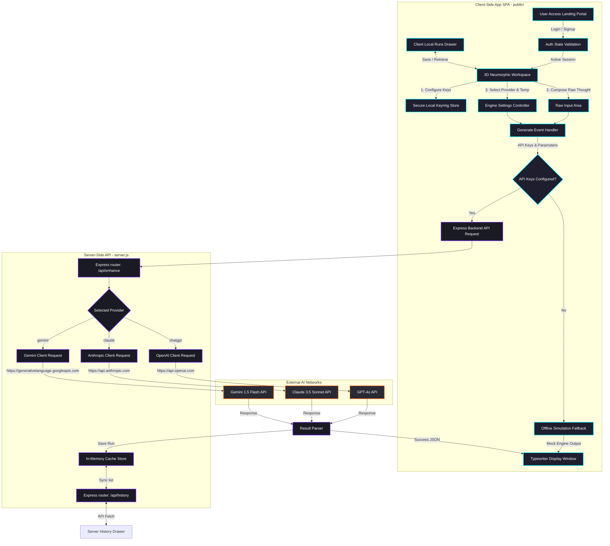

# PromptMaster 🚀
> Premium Skeuomorphic Prompt Optimization Dashboard and Client-Server Workspace.

PromptMaster is a developer tool designed to transform raw, unstructured thoughts into structured, precision prompt engineering blueprints for advanced AI agents. Featuring an interactive 3D WebGL WebSpace and a dual-tier history cache, PromptMaster allows developers to refine prompts across ChatGPT, Claude, and Gemini engines seamlessly.

---

## 📐 System Architecture & Data Flow

The following diagram maps how the client SPA and the Express backend interact to optimize prompts and manage historical logs:



---

## ⚡ Core Features

1. **Tactile Skeuomorphic Dashboard**: Neumorphic input cards, sliding drawers, and animated settings overlays responding with precise visual feedback.
2. **Interactive 3D Backdrop**: Built on Three.js, rendering a responsive viewport filled with glass-morphic cubes (Python, Doc, Database, etc.) that twist and tilt dynamically matching your mouse cursor.
3. **Multi-Model Provider Engine**: Switch optimizations dynamically between **ChatGPT** (GPT-4o), **Claude** (3.5 Sonnet), and **Gemini** (1.5 Flash).
4. **Keyring Credentials Store**: Store your API tokens in local browser `localStorage` securely, transmitting them on-the-fly via secure request headers to prevent server-side caching or exposure.
5. **Dual-Tier History System**:
   - **Local Cache**: Save specific highlights and configurations persistently inside your browser's local sandbox.
   - **Server Cache**: Keep track of the active team log stored in the Express in-memory history cache (up to 100 entries).
6. **Creativity Control**: Precision slider controlling the API temperature parameters, enabling deterministic layouts vs creative brainstorm mappings.

---

## 💻 Tech Stack

- **Frontend**: Vanilla Javascript (ES6), HTML5 Canvas (Three.js WebGL rendering), CSS3 Custom Variables (Dynamic Provider Theming).
- **Backend**: Node.js, Express, CORS, Dotenv, Node-Fetch.
- **Deployment**: Server-client modular architecture. Static client files served by Express.

---

## 🚀 Workflows & Developer Guide

### 1. Local Environment Configurations
Create a `.env` file in the root directory of the project to pre-configure your API endpoints (optional, as they can also be defined inside the application's Credentials modal):

```ini
PORT=8000
OPENAI_API_KEY=your_openai_api_key_here
GEMINI_API_KEY=your_gemini_api_key_here
ANTHROPIC_API_KEY=your_anthropic_api_key_here
```

### 2. Installations and Launch
Install the project dependencies and run the server locally:

```bash
# Install NPM packages
npm install

# Start development server
npm run dev
```
Once started, navigate to: **`http://localhost:8000`** in your browser.

---

## 🛠️ Step-by-Step Functional Guide

### Workflow A: Secure Authentication
1. Launch the page to be greeted by the **Secure Access Portal**.
2. Click **Log In** or **Sign Up** to activate the auth modals.
3. Complete registration or click GitHub/Google Social login buttons to initialize the local session tokens and launch the workspace.

### Workflow B: Configuring Provider Keys
1. In the top-right toolbar, click the **Key/Settings icon**.
2. Input your OpenAI, Anthropic, or Gemini API keys.
3. Click **Save Configuration**. (API keys will be stored locally inside your browser and won't be saved on the Express server disk).

### Workflow C: Optimizing a Prompt
1. Input your rough concept (e.g. `write a python stock tracker`) in the **Raw Thought** text card.
2. Select your provider style from the neumorphic pill toggle (**ChatGPT**, **Claude**, or **Gemini**). Note how the interface theme shifts color values matching the target agent colorway.
3. Adjust the **Creativity (Temp)** slider. Lower values yield structured templates; higher values yield fluid brainstorm structures.
4. Click **GENERATE**. If keys are missing, the client invokes an offline simulation (failsafe template injector).
5. The result appears in the **Precision Prompt** window with a typewriter rendering. Click **Copy** to export the result to your clipboard.

### Workflow D: Managing Prompt Histories
- **Manual Client Cache**: Click **SAVE** on the left input card to send the configuration to the client-saved drawer (toggleable using the top-right history icon).
- **Server API Logs**: Click the **Left History Drawer icon** on the left side of the dashboard to sync logs currently running on the Node server. Delete individual instances or clear all inputs.

---

## 📡 API Reference Specifications

### 1. Optimize Prompt
* **Endpoint**: `POST /api/enhance`
* **Content-Type**: `application/json`
* **Headers** (optional client keys):
  * `X-OpenAI-Key`: OpenAI Secret Token
  * `X-Gemini-Key`: Gemini Developer Token
  * `X-Anthropic-Key`: Anthropic API Token
* **Request Body**:
```json
{
  "rawText": "Create a simple Node script to read files",
  "provider": "chatgpt",
  "systemInstruction": "Optional custom prompt optimization parameters",
  "temperature": 0.7
}
```
* **Success Response (200 OK)**:
```json
{
  "optimized": "### System Role\n..."
}
```

### 2. Retrieve Server History
* **Endpoint**: `GET /api/history`
* **Success Response (200 OK)**: Returns the last 50 optimized prompt entries.

### 3. Delete History Entry
* **Endpoint**: `DELETE /api/history/:id`
* **Success Response (200 OK)**: `{ "success": true }`

### 4. Clear All History
* **Endpoint**: `DELETE /api/history`
* **Success Response (200 OK)**: `{ "success": true }`